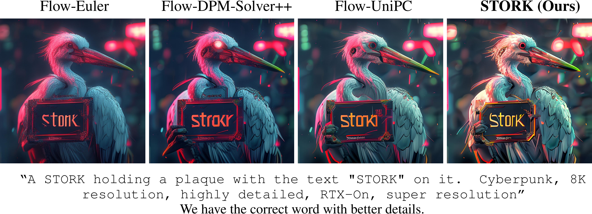

# STORK: Faster Diffusion And Flow Matching Sampling By Resolving Both Stiffness And Structure-Dependence
The official implementation for the paper [STORK: Faster Diffusion And Flow Matching Sampling By Resolving Both Stiffness And Structure-Dependence](https://arxiv.org/abs/2505.24210) by [Zheng Tan](https://zt220501.github.io/), [Weizhen Wang](https://weizhenwang-1210.github.io/), [Andrea L. Bertozzi](https://www.math.ucla.edu/~bertozzi/), and [Ernest K. Ryu](https://ernestryu.com/).

--------------------

STORK is a **training-free** **structurally independent** ODE solver for high-fidelity generation within popular NFEs, applicable to both **diffusion** and **flow-matching** models. Experiments show that STORK excels in generation quality and outperforms the SoTA ODE solvers on various datasets, models, and scales.

[SANA](https://arxiv.org/abs/2410.10629) with STORK:


# Using STORK (original implementation)
For the **not-diffusers** implementation, refer to `external` directory for sample code and further instructions. 

# Using STORK from Diffusers
We have released the experimental version in `STORKScheduler.py`. This is already compatible with stable diffusion 3. We are actively coordinating witht the Huggingface people for official integration. 

<!-- # TODO
- [x] Release a cleaner version of STORK-2 and STORK-4 for diffusion and flow-matching models.
- [ ] Integration with the Diffusers package.
- [ ] Sample Diffusers code. -->

# Reproduction of Reported Numbers

## Benchmarking CIFAR-10, LSUN-Bedroom, MS-COCO
We based on the PNDM codebase. See `external/PNDM`

Due to size limit, we delete the pre-computed FID stats and the metadata for coco. This will be available upon requests.

## Benchmarking MJHQ-30K
We based off the DPM-Solver codebase. See `external/Sana`

# Citation
If you find our work useful, please cite 
```bib
@misc{tan2025storkfasterdiffusionflow,
      title={STORK: Faster Diffusion And Flow Matching Sampling By Resolving Both Stiffness And Structure-Dependence}, 
      author={Zheng Tan and Weizhen Wang and Andrea L. Bertozzi and Ernest K. Ryu},
      year={2025},
      eprint={2505.24210},
      archivePrefix={arXiv},
      primaryClass={cs.CV},
      url={https://arxiv.org/abs/2505.24210}, 
}
```

